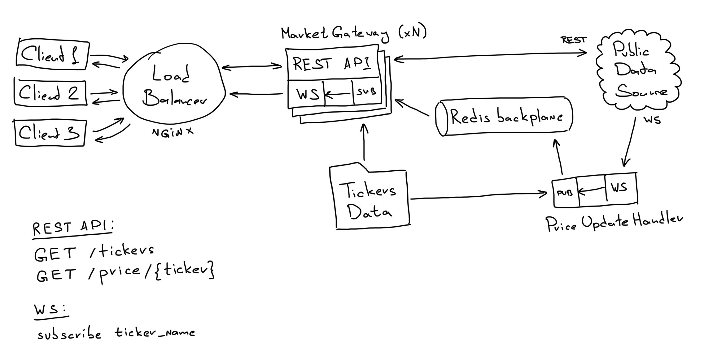

Exchange rates tracker
======================

A demo-service which provides REST API and WebSocket endpoints for live financial instrument prices sourced from a public data provider and efficiently handles over 1,000 subscribers.

Repository
----------
https://github.com/slavabashkan/rate-tracker

Description
-----------

The system contains the following modules:
- **Price Update Handler Service** establishes a WebSocket connection with a public data source, receives price updates and publishes them to the message broker.
- **Market Gateway Services** provides a REST API to get ticker data by request and exposes a WebSocket endpoint to clients to broadcast live price updates. It subscribes to the message broker to retrieve these updates.
- **Redis** as the message broker between these services.
- **NGINX** as the entry point and load balancer between Market Gateway instances.
- **Tickers Data** stored in `CommonItems/AvailableTickers.json`.

Available tickers are:
- USDTEUR
- DOGEUSD
- BTCUSD

Current prices are fetched from the https://cex.io service via REST API.
Price updates are fetched from the https://finnhub.io service via WebSockets.

**Notes**: 
- In a real-life production system, the Tickers Data should be stored in a database.
- Default logging to the console has been used.

Elapsed Time
------------
- Analytics, system design: 3h
- Search and test for a suitable public API to cover all cases: 4.5h
- Technical research: 2h
- Development + testing: 22h
- Distribution, deployment + testing: 3h

API Key
-------
An API Key can be aquired here: https://finnhub.io/dashboard.
It should be specified in `PriceUpdateHandlerService/appsettings.json` -> `PublicSourceApiKey`.

Deployment via Docker
---------------------
The easiest way to deploy the project is by using Docker. It only requires Docker to be installed.

Download the sources from https://github.com/slavabashkan/rate-tracker:
`git clone git@github.com:slavabashkan/rate-tracker.git`

`cd rate-tracker`

Specify the API key in `PriceUpdateHandlerService/appsettings.json` -> `PublicSourceApiKey`.

Build and run the project:
`docker-compose up --build`

The following containers will be built and started:
- **redis**: Redis database used as a message broker
- **price-update-handler-service**: Single instance of the ticker price update subscriber
- **market-gateway-service-1** and **market-gateway-service-2**: Two instances of REST API and WebSocket gateway
- **nginx**: NGINX as the entry point and load balancer

To uninstall the entire project, use:
`docker-compose down`

Manual Deployment
-----------------
Another way to deploy the project is manually. Requirements: Docker, .NET Core 7 SDK.

Download the sources from https://github.com/slavabashkan/rate-tracker:
`git clone git@github.com:slavabashkan/rate-tracker.git`

`cd rate-tracker`

Specify the API key in `PriceUpdateHandlerService/appsettings.json` -> `PublicSourceApiKey`.

If you have Redis installed, specify the connection string in:
- `MarketGatewayService/appsettings.json` -> `RedisConnection`
- `PriceUpdateHandlerService/appsettings.json` -> `RedisConnection`

If not, run the Redis container:
`docker-compose -f docker-compose.redis.yml up`

Restore and build the solution:
`dotnet restore RateTracker.sln`
`dotnet build RateTracker.sln`

Run PriceUpdateHandlerService:
`cd PriceUpdateHandlerService/bin/Debug/net7.0/`
`dotnet PriceUpdateHandlerService.dll`

Run MarketGatewayService:
`cd MarketGatewayService/bin/Debug/net7.0`
`dotnet MarketGatewayService.dll --urls "http://localhost:15151"`

Using REST API
--------------
Swagger is available here:
http://localhost:15151/swagger/index.html

Endpoints:
- GET http://localhost:15151/api/Tickers/GetAll - Returns all supported tickers
- GET http://localhost:15151/api/Price/{ticker} - Returns the current price of the specified ticker

Using WebSockets
----------------
Endpoint to connect:
ws://localhost:15151/ws

To subscribe to ticker price updates (e.g. BTCUSD), send the following message via WebSockets:
`subscribe BTCUSD`

To unsubscribe, send:
`unsubscribe BTCUSD`
